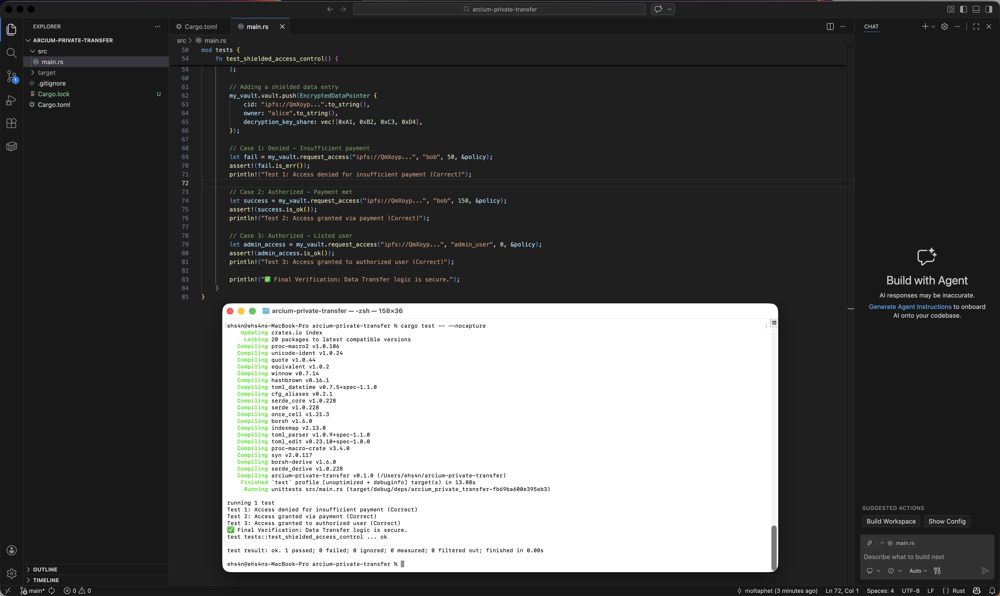

# 🔐 Arcium Private Data Transfer & Access Control
**Shielded Access Management for Decentralized Encrypted Storage**

Arcium Private Data Transfer is a robust framework designed to manage the secure exchange of sensitive data. By utilizing the Arcium Network's **Multi-Party Computation (MPC)**, this engine acts as a confidential orchestrator, enforcing access policies on encrypted data without ever exposing the underlying decryption keys.

---

## 🛡️ The Problem: Centralized Gatekeepers
Standard storage solutions (S3, IPFS, Arweave) are excellent for data persistence but fail at privacy:
* **Decryption Risk**: Managing keys usually requires a trusted central server—a single point of failure.
* **Lack of Granular Control**: Implementing "Pay-to-Decrypt" or "Role-Based Access" often reveals metadata or requires revealing the raw data to the provider.

## ✨ The Arcium Solution
* **Shielded Policy Enforcement**: Access conditions (identity, payment, or time) are evaluated within the Arcium Shielded State.
* **Distributed Key Shares**: Decryption keys are never stored in one place. They are reconstructed only when the MPC cluster confirms all conditions are met.
* **Trustless Monetization**: Enables a secure data economy where creators can sell access to data without a middleman.

---

## ⚙️ Core Logic & Architecture
The engine manages `EncryptedDataPointers`, which link encrypted files on decentralized storage to their respective access logic.

1. **Request Phase**: A user requests access to a specific Content ID (CID).
2. **Confidential Audit**: The engine checks the user's identity and payment status against the `AccessPolicy`.
3. **Shielded Authorization**: If the criteria are met, the MPC cluster facilitates the reconstruction of the decryption key share for the authorized requester.

---

## 🚀 Getting Started

### Prerequisites
* Rust & Cargo (Latest Stable)
* Arcium SDK (Simulated Environment)

### Installation
```bash
git clone [https://github.com/](https://github.com/)[YOUR_USERNAME]/arcium-private-transfer.git
cd arcium-private-transfer

```

### Running the Confidential Audit Simulation

Execute the test suite to verify that the access control policies are correctly enforced:

```bash
cargo test -- --nocapture

```

---

## 🛠 Project Structure

* `src/main.rs`: Core vault logic and policy enforcement engine.
* `Cargo.toml`: Project configuration and dependencies.
* `scs.png`: Proof of successful terminal execution and verification.

---

## 📊 Terminal Execution Verification

To ensure the integrity of the access control logic, the following test suite validates the shielded conditions. 

The screenshot below captures the successful execution of the `cargo test` command, confirming that the **Arcium Shielded Data Vault** correctly denies unauthorized requests and grants access only when policy requirements are met.

<p align="center">
  
</p>

---

**Final Result:** `test result: ok. 1 passed; 0 failed; 0 ignored;` ✅

---

## 🤝 Contribution

Developed for the **Arcium Developer RTG** - Private Data Transfer & Access Control Track.
**Securing the world's data through Confidential Computing.**
